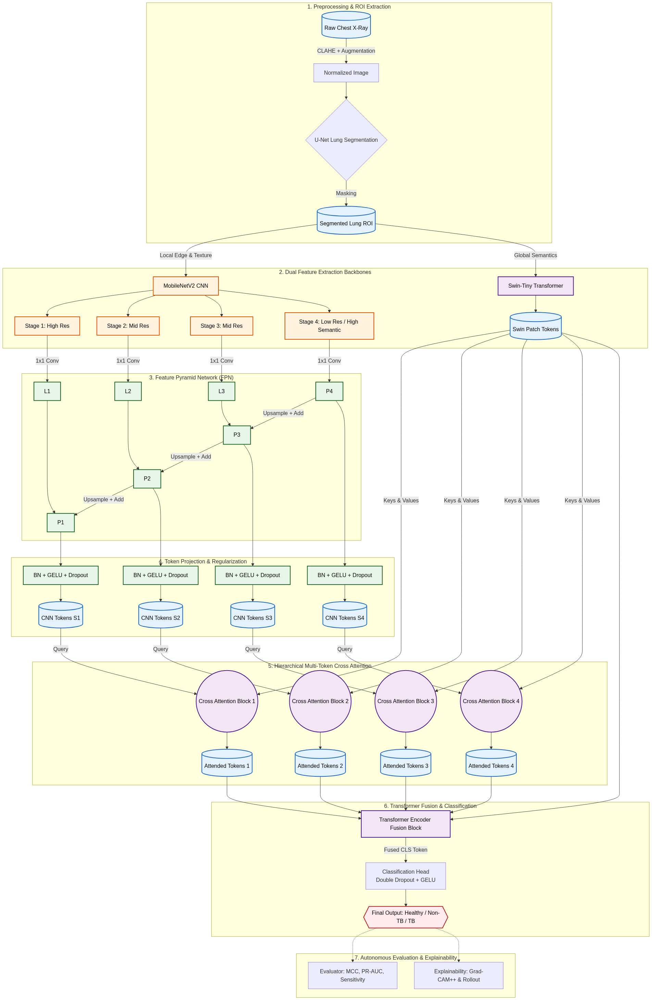

# HCT-TB: Hierarchical Cross-attention Transformer for Tuberculosis Detection



HCT-TB is a state-of-the-art, explainable hybrid deep learning framework designed to detect Tuberculosis (TB) from Chest X-Ray (CXR) images. 

Standard Vision Transformers often struggle with fine-grained, localized anomalies like miliary TB nodules, while pure CNNs lack global contextual understanding. HCT-TB solves this by introducing a unique **cross-modal fusion pipeline**:
1. **Segmentation:** U-Net isolates the lung ROI to prevent algorithmic bias and shortcut learning.
2. **Multi-Scale Spatial Extraction:** MobileNetV2 coupled with a Feature Pyramid Network (FPN) extracts localized, high-resolution features critical for detecting small lesions.
3. **Global Context:** A Swin Transformer models the global relationships across the radiograph.
4. **Hierarchical Cross-Attention:** Instead of simple late fusion (concatenation), CNN spatial features are projected as localized tokens and injected directly into the Swin Transformer's attention space.
5. **Explainability:** Integrated Grad-CAM++ ensures clinical transparency by precisely highlighting pathological regions on the CXR.

## Repository Structure
- `models/`: Contains the core architecture (Swin Transformer, MobileNetV2 FPN, U-Net, and Cross-Attention Fusion modules).
- `training/`: Training loops, optimizers, and schedulers.
- `evaluation/`: Scripts for calculating metrics (Accuracy, Precision, Recall, F1, AUC).
- `visualization/`: Grad-CAM++ integration for model explainability.
- `configs/`: Hyperparameters and model configuration files.

## Getting Started

1. Clone the repository:
   ```bash
   git clone https://github.com/ArhitBasu/HCT-TB.git
   cd HCT-TB
   ```
2. Install the required dependencies:
   ```bash
   pip install -r requirements.txt
   ```
*(Note: Please ensure you configure your dataset paths in the `configs/` directory before running the training scripts).*

## License
This project is licensed under the MIT License - see the LICENSE file for details.
